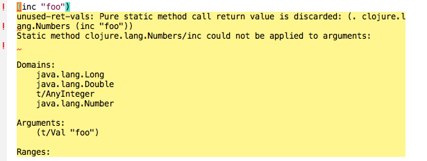

squiggly-clojure
================



Flycheck checker for Clojure, using
[eastwood](https://github.com/jonase/eastwood),
[core.typed](http://typedclojure.org/)
and
[kibit](https://github.com/jonase/kibit)
via
[cider](https://github.com/clojure-emacs/cider).

See this [blog post](http://blog.podsnap.com/squiggly.html) for more.

### Warnings!

Read these warnings:

  * It is assumed that you are familiar with each of these linters, so
    please read the their documentation.  There, you will find additional
    warnings.
  * Do not use `squiggly-clojure` unless your code can be
    reloaded without side effects, as the linters will
    be reloading it repeatedly.
  * Eastwood and Kibit are typically run via lein plugins, and use within the
    REPL vm, as squiggly requires, is not officially supported.  (Though in
    practice it works well.)


### Installation

The package is available on [Melpa](http://melpa.org/):

    M-x package-install flycheck-clojure

Alternatively, (1) clone this project and put its `elisp/flycheck-clojure/` directory
on your path, or (2) download
[this one file](https://github.com/clojure-emacs/clojure-mode/blob/master/clojure-mode.el),
and install it wherever you like.

Add to your ```.emacs```:

~~~.el
(eval-after-load 'flycheck '(flycheck-clojure-setup))
(add-hook 'after-init-hook #'global-flycheck-mode)
~~~

Installing [flycheck-pos-tip](https://github.com/flycheck/flycheck-pos-tip) as well is strongly recommended, so that linting and type errors don't clash with cider's eldoc information.

    M-x package-install flycheck-pos-tip

And add this to your `.emacs`:

~~~.el
(eval-after-load 'flycheck
  '(setq flycheck-display-errors-function #'flycheck-pos-tip-error-messages))
~~~

Alternatively to [flycheck-pos-tip](https://github.com/flycheck/flycheck-pos-tip)
you can use [flycheck-tip](https://github.com/yuutayamada/flycheck-tip)

    M-x package-install flycheck-tip

In that case add to your ```.emacs```:

~~~.el
(require 'flycheck-tip)
(flycheck-tip-use-timer 'verbose)
~~~

Either way, you should now get the snazzy yellow post-it messages when the cursor is on a squiggly underline.

If you're used to `flycheck` but not used to `cider`, you may want

~~~.el
(add-hook 'cider-mode-hook
  (lambda () (setq next-error-function #'flycheck-next-error-function)))
~~~

to override the binding to ````cider-jump-to-compilation-error`.

### Dependencies in Clojure:

The Clojure code used to invoke the various specific linters is in Clojars:

https://clojars.org/acyclic/squiggly-clojure/versions/0.1.9-SNAPSHOT


If you're using a current release of Cider, then this dependency, along with all of Cider's will be injected automatically for you
upon `cider-jack-in`.
(Specifically, the dependencies will be added to  `cider-jack-in-dependencies` unless you specifically disable it by
setting `flycheck-clojure-inject-dependencies-at-jack-in` to nil.)


If you want to `cider-attach` to a running repl, then you'll need to specify the proper dependencies in your
[`profiles.clj`](https://github.com/technomancy/leiningen/blob/master/doc/PROFILES.md#profiles) or to the project-specific
`project.clj`, as part of the `:dependencies` vector.  E.g.

~~~.clj
;; profiles.clj
{:repl {:plugins [[cider/cider-nrepl "A.B.C"] ;; subsitute A.B.C from emacs cider-version variable
                  ;...
                  ]
        :dependencies [[acyclic/squiggly-clojure "x.y.z" :exclusions [org.clojure/tools.reader]]  ;; substitute x.y.z from above
		               ;...
					   ]}
}
~~~
Note that there may be case differences between emacs' `cider-version` and the proper `cider-nrepl` version for the
profile; the latter is usually upper-case, e.g. `"0.15.0-SNAPSHOT"`.

`squiggly-clojure` in turn pulls in the dependencies from its `project.clj`.


Note that if you want to use `core.typed`, you will have to add a dependency and make some changes to your `ns`
as described on the [github page](https://github.com/clojure/core.typed).

### Configuration

See the `sample-project` subdirectory for some examples of the configuration methods
described below.

#### From Emacs

Squiggly Clojure comprises three Flycheck checkers, `clojure-cider-typed`,
`clojure-cider-kibit` and `clojure-cider-eastwood`.  You may exclude one or
more of these by including them in the `flycheck-disabled-checkers` list.
This can be done via the `Local Variables:` block at the end of a `.clj` file,
e.g.

~~~.clj
;; Local Variables:
;; flycheck-disabled-checkers: (clojure-cider-kibit)
;; End:
~~~

but the following two methods are preferable for such persistent settings.

#### In `project.clj`

Add or merge

~~~.clj
  :plugins [[lein-environ "1.0.0"]]
~~~

and set an `:env` option map that includes `:squiggly` , e.g.

~~~.clj
{:env {:squiggly {:checkers [:eastwood]
                  :eastwood-exclude-linters [:unlimited-use]}}}
~~~

Here, you specify *included* checkers, as `:eastwood`, `:kibit` or `:typed`.  If you
set `:eastwood-exclude-linters`, it will be passed directly to Eastwood as described
in its documentation.  This configuration will apply to all source files in the
project unless overridden by...

#### Namespace metadata

E.g.

~~~.clj
(ns sample-project.core
  {:squiggly {:checkers [:eastwood :typed]
              :eastwood-exclude-linters [:unlimited-use]}
   :lang :core.typed}
  (:require [clojure.core.typed] :as t)
  (:use [clojure.stacktrace])     ;; warning suppressed by :eastwood-exclude-linters
  )
~~~

#### Precedence

If set in the namespace metadata, the value of `:squiggly` fully overrides
anything set in the
`project.clj`: no fancy merging is performed.

And note that, if a checker is in `flycheck-disabled-checkers`, it will never
be invoked no matter what you set in Clojure code.

#### Available options

~~~.clj
  :checkers                    [:eastwood :typed :kibit]
  :eastwood-exclude-linters    [] # see Eastwood documentation
  :eastwood-options            {} # See Eastwood documentation
~~~

Note that `:eastwood-exclude-linters` is here for backwards compatibility, and
specifying `:eastwood-options {:exclude-linter [...]}` would override it.  If
you have really a lot of Eastwood options you want to specify, you can specify
`:config:files` in the `:eastwood-options` map and really go to town.


### Debugging and bug reporting

First, see the warnings above.  The general theme is that we depend on
three external linters, problems or incompatibilities with any of which might
now manifest in emacs.

You should start by making sure that `flycheck-clojure` has is in fact being initialized.
After you `cider-jack-in`, the `*Messages*` buffer will show a message like
```
[nREPL] Starting server via /home/pnf/bin/lein update-in :dependencies conj \[acyclic/squiggly-clojure\ \"0.1.9-SNAPSHOT\"\ \:exclusions\ \[org.clojure/tools.reader\]\] -- update-in :dependencies conj \[nrepl\ \"0.6.0\"\] -- update-in :plugins conj \[refactor-nrepl\ \"2.5.0-SNAPSHOT\"\] -- update-in :plugins conj \[cider/cider-nrepl\ \"0.23.0-SNAPSHOT\"\] -- repl :headless :host localhost
```
If you don't see `acyclic/squiggly-clojure` among the `:dependencies`, then, most likely, will also not see
it in `cider-jack-in-dependencies`.  Either `flycheck-clojure-setup` was never called, or it was called
*before* cider itself was loaded and the `alist` was overwritten.  You should check your emacs configuration, but for now
run `flycheck-clojure-setup` again manually.

Once you're sure that `flycheck-clojure` is in fact initialized, you can debug further by looking at the
messages between cider and the clojure process.  These will be in the 
`*nrepl-messages...` buffer, but only if you have `(setq nrepl-log-messages t)`; messages are no longer
being logged by default.
Among other things, you'll find here the Clojure expressions that
were evaluated to initiate the checking, e.g.

~~~
  op  "eval"
  session  "5f8764c8-3f2b-4871-9a26-766b4b5af314"
  code  "(do (require 'squiggly-clojure.core) (squiggly-clojure.core/check-tc 'sample-project.core))"
  id  "20"
~~~

You can see output from this command by looking for messages with the same `id`, e.g.

~~~
  id  "20"
  ns  "user"
  session  "5f8764c8-3f2b-4871-9a26-766b4b5af314"
  value  "\"[{\\\"line\\\":16,\\\"column\\\":3,\\\"file\\\":\\\"sample_project\\\\/core.clj\\\",\\\"level\\\":\\\"error\\\",\\\"msg\\\":\\\"Static method clojure.lang.Numbers\\\\/inc could not be applied to arguments:\\\\n\\\\n\\\\nDomains:\\\\n\\\\tNumber\\\\n\\\\nArguments:\\\\n\\\\t(clojure.core.typed\\\\/Val \\\\\\\"foo\\\\\\\")\\\\n\\\\nRanges:\\\\n\\\\tNumber\\\\n\\\\n\\\"},{\\\"line\\\":25,\\\"column\\\":13,\\\"file\\\":\\\"sample_project\\\\/core.clj\\\",\\\"level\\\":\\\"error\\\",\\\"msg\\\":\\\"Function range could not be applied to arguments:\\\\n\\\\n\\\\nDomains:\\\\n\\\\tNumber\\\\n\\\\nArguments:\\\\n\\\\tclojure.core.typed\\\\/Any\\\\n\\\\nRanges:\\\\n\\\\t(clojure.core.typed\\\\/ASeq clojure.core.typed\\\\/AnyInteger)\\\\n\\\\n\\\"}]\""
~~~

In this case, you can see that type-checking returned a map of results correctly.

If results are correctly returned in the REPL but are not displayed in the Emacs buffer, then there may be an
elisp bug to report.

If you see something that looks like an error, you should reproduce it
by running the Clojure expression directly from the REPL, e.g. in this case

~~~.clj
  (do (require 'squiggly-clojure.core) (squiggly-clojure.core/check-tc 'sample-project.core))
~~~

If this returns an error, you should then try replicating **outside the REPL** using the linter's lein plugin.
In the example above, that would be [lein-typed](https://github.com/typedclojure/lein-typed), which must be
installed separately.

If all linters work propertly outside of the REPL, there may be a reportable bug in the squiggly clojure
code, though historically it's usually turned out to be related to dependency conflicts between the linters
and the project being linted.  Accordingly, when reporting a possible bug, please include the output of `lein deps :tree`
or `lein with-profile something deps`, where `something` is probably `repl`, as appropriate.

If, due to one of these or other problems, ```flycheck``` does not
receive the proper callbacks, it may be stuck in a state where it
will never try to check again.  To reset (modulo some memory leaks perhaps)
try turning ```flycheck-mode``` off and then on.

## Developer hints

If you're playing with the squiggly elisp and clojure code, it's cleanest to to start up
emacs with the related configurations commented-out in your `init.el` and `profiles.clj`.
The easiest workflow is then

1. `lein install` the package locally
2. before starting cider, eval `flyckeck-clojure.el` manually and `(flycheck-clojure-setup)`
3. then `cider-jack-in`, which should now start lein with your local library, with whatever
   dependencies you might have changed.
4. subsequently, you can re-eval squiggy-clojure's `core.clj` as often as you like

### TODO:
* Deal better with catastrophic failure of a checker.  Currently, we silently ignore exceptions.
* Performance optimizations: throttling and narrowing.
